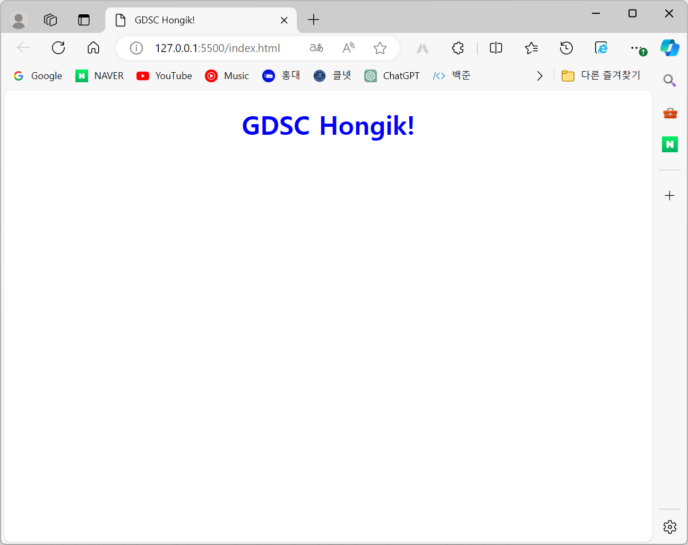

# index.html 파일과 style.css 파일을 작성하는 방식을 배웠다.
- 

## style.css
### 태그: h1
### 색: blue
### 정렬(text-align): center

## index.html
### 언어(html lang): "en"
### head: meta(charset, name, content), title, link(rel, href)
### body: h1